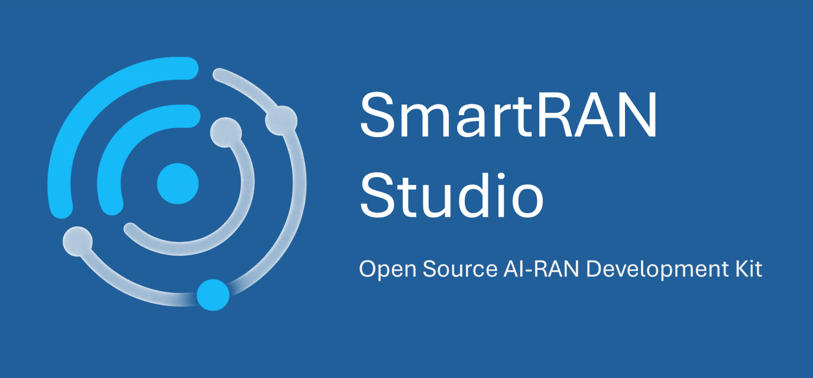

# SmartRAN Studio

<p align="center">
  
</p>

**GPU-accelerated 5G/6G radio access network simulation platform with container-first architecture**

[](LICENSE)
[](https://www.docker.com/)
[](https://developer.nvidia.com/cuda-zone)

## 📋 Table of Contents

- [Overview](#-overview)
  - [The Challenge](#the-challenge)
  - [The Solution](#the-solution)
  - [Why This Matters](#why-this-matters)
  - [Who Is This For?](#who-is-this-for)
- [Key Features](#-key-features)
- [Architecture](#-architecture)
- [Quick Start](#-quick-start)
- [Documentation](#-documentation)
- [Use Cases](#-use-cases)
- [Technology Stack](#-technology-stack)
- [Performance](#-performance)
- [Development](#-development)
- [Roadmap](#-roadmap)
- [Contributing](#-contributing)
- [License](#-license)
- [Branding](#-branding)
- [Acknowledgments](#-acknowledgments)

## 🎯 Overview

SmartRAN Studio is an **open-source, end-to-end development platform for wireless network intelligence** — combining GPU-accelerated simulation, data infrastructure, and ML-ready pipelines in a unified environment. It makes AI-RAN development accessible by providing the complete infrastructure workflow, so you can focus on building intelligence instead of building tooling.

### The Challenge

The wireless industry is racing toward AI-native networks and 6G intelligence, but there's a fundamental problem: **having powerful tools isn't the same as having a complete development workflow**.

Take NVIDIA Sionna — it's a sophisticated RF simulation SDK built for wireless research, but it's just that, an SDK. To actually develop AI on top of it, you need far more than the library itself. You need to architect network logic and simulation structure. You need the right GPU environment with CUDA, TensorFlow, and supporting libraries properly configured. You need data processing pipelines to transform raw outputs into ML-ready formats. You need database schemas to organize and query results at scale. You need REST APIs, service orchestration, containerization, and the entire data infrastructure to go from simulation runs to trained models.

**For AI-RAN development, that complete workflow simply doesn't exist in an open, standardized form.** Every research group or company working on network intelligence ends up building the same supporting infrastructure from scratch. The actual ML and algorithm work becomes 20% of the project — the other 80% is simulation setup, data management, environment configuration, processing pipelines, and tooling just to get structured data you can train models on. Infrastructure becomes the project, and months disappear before you can even start on the intelligence work.

### The Solution

SmartRAN Studio provides that complete workflow — open-source, ML-ready, and immediately usable.

This isn't just Sionna wrapped in a container. It's a **fully operational platform for AI-RAN development** where all the supporting infrastructure is already built, integrated, and tested. The simulation engine is architected as a proper network-level simulator with multi-cell coordination and realistic RF propagation. The GPU environment is containerized with all dependencies pre-configured (CUDA, TensorFlow, RAPIDS). Data pipelines transform raw measurements into structured formats stored in a multi-model database with documented schemas. REST APIs expose simulation control and data extraction. A web-based interface provides RF engineer-friendly workflows. Service orchestration ties everything together with Docker Compose.

**The entire workflow from simulation to AI development is ready.** You can `docker compose up`, initialize a network, run simulations, extract structured data, and immediately start building ML models — all without wrestling with environment setup, data management, or infrastructure architecture. The platform handles running simulations at scale, persisting results, organizing data, and providing GPU-accelerated processing environments. **You focus on feature engineering, model architectures, training algorithms — the actual intelligence work.**

This makes AI-RAN development accessible in a way it hasn't been before. Instead of needing specialized infrastructure or managed services, there's now an open foundation that anyone can run, modify, and build on. The barrier to entry shifts from "months of infrastructure work" to "clone and docker compose up."

### Why This Matters

SmartRAN Studio establishes an **open standard for the complete AI-RAN development workflow** — from simulation to data extraction to ML-ready infrastructure. It makes network intelligence development accessible to researchers, engineers, and organizations who need the entire pipeline, not just the simulation SDK. The infrastructure, data management, and processing environments are solved. You can start working on the actual intelligence immediately.

### Who Is This For?

- **RF Engineers** - Network planning, optimization, and troubleshooting in a safe sandbox environment
- **AI/ML Researchers** - Generate realistic wireless datasets and test network intelligence algorithms
- **Network Operators** - Prototype configurations and validate changes before deploying to production
- **Academic Researchers** - Physical layer research with accessible, GPU-accelerated simulation
- **Students** - Learn RAN concepts with production-like tools and real-world workflows

## ✨ Key Features

- 🐳 **Container-First Development** - Complete stack runs in Docker with zero local setup
- 🚀 **GPU-Native Architecture** - Built for NVIDIA GPUs from the ground up using Sionna + TensorFlow
- 🎮 **Web-Based CLI** - Terminal-style interface accessible from any browser
- 📊 **Flexible Topology** - Dynamic site/cell management with per-cell antenna configuration
- 💾 **State Management** - Save/load configurations, persistent measurement snapshots
- 🔧 **Production Ready** - Microservices architecture with orchestrated Docker Compose deployment

## 🏗️ Architecture

```
┌─────────────┐
│   Browser   │ ← Access web CLI at localhost:8080
└──────┬──────┘
       │
┌──────▼───────────────────────────────────────┐
│  Frontend (React + Vite)                     │
│  • Terminal-style CLI                        │
│  • Command history & autocomplete            │
│  • Interactive wizards                       │
└──────┬───────────────────────────────────────┘
       │
┌──────▼───────────────────────────────────────┐
│  Backend (FastAPI)                           │
│  • Command processing                        │
│  • Session management                        │
│  • Configuration save/load                   │
└──┬────────────────────────┬──────────────────┘
   │                        │
   │                  ┌─────▼──────┐
   │                  │  Database  │
   │                  │ (ArangoDB) │
   │                  └────────────┘
   │
┌──▼──────────────────────────────────────────┐
│  Simulation Engine (GPU Container)          │
│  • NVIDIA Sionna RF simulation              │
│  • TensorFlow + CUDA acceleration           │
│  • Multi-cell propagation                   │
│  • RSRP computation                          │
└─────────────────────────────────────────────┘
```

## 🚀 Quick Start

### Prerequisites

- **Docker** & **Docker Compose**
- **NVIDIA GPU** with 8GB+ VRAM
- **NVIDIA Container Toolkit** ([install guide](https://docs.nvidia.com/datacenter/cloud-native/container-toolkit/install-guide.html))

**Verify GPU access:**
```bash
docker run --rm --gpus all nvidia/cuda:12.0-base nvidia-smi
```

### ⚠️ Security Note

**The default credentials in `compose.yaml` are for LOCAL DEVELOPMENT ONLY.**

Before deploying beyond your local machine:
1. Open `compose.yaml`
2. Change `ARANGO_ROOT_PASSWORD` to a strong, unique password
3. Update the same password in all three services (`smartran-studio-arangodb`, `smartran-studio-sim-engine`, `backend`)

See **[Configuration Guide](docs/CONFIGURATION.md)** for details.

### 1. Clone & Start

```bash
git clone <repository-url>
cd smartran-studio
docker compose up -d
```

This starts all services:
- 🌐 **Web UI**: http://localhost:8080
- 🔌 **Sim Engine API**: http://localhost:8000
- 🔌 **Backend API**: http://localhost:8001
- 💾 **Database UI**: http://localhost:8529

### 2. Initialize Simulation

Open http://localhost:8080 and run:

```bash
srs init --default
```

Creates a simulation with:
- 10 sites with dual-band cells (2.5 GHz + 600 MHz)
- 30,000 UEs distributed in a box layout
- Ready for immediate use

### 3. Run Commands

```bash
# Check status
srs status

# Query network
srs query cells
srs query sites

# Update configuration
srs update cell 0 --tilt=12.0

# Run simulation
srs sim compute --name="baseline"

# Save configuration
srs config save baseline
```

### 4. Stop

```bash
docker compose down
```

## 📖 Documentation

### Getting Started
- **[Getting Started](docs/GETTING_STARTED.md)** - Complete setup guide
- **[Configuration Guide](docs/CONFIGURATION.md)** - ⚠️ **Change default credentials** and customize deployment

### Using SmartRAN Studio
- **[CLI Reference](docs/CLI_REFERENCE.md)** - All available commands
- **[Data Analysis Guide](docs/DATA_ANALYSIS_GUIDE.md)** - 📊 **Complete workflow**: compute → extract → analyze results

### Technical Reference
- **[Architecture](docs/ARCHITECTURE.md)** - System design and components
- **[Database Schema](docs/DATABASE_SCHEMA.md)** - ArangoDB schema and query reference
- **[Development](docs/DEVELOPMENT.md)** - Container-first development guide

## 🎯 Use Cases

### Network Planning & Optimization
- **Site placement analysis** - Test coverage before deploying hardware
- **Antenna configuration tuning** - Optimize tilt, azimuth, and transmit power across cells
- **Interference assessment** - Identify and mitigate inter-cell interference
- **Capacity planning** - Model user density and load distribution

### AI-RAN & 6G Research
- **Dataset generation** - Create structured, user-level measurements at scale for ML training
- **Algorithm validation** - Test network intelligence algorithms in controlled, reproducible environments
- **Feature engineering** - Explore what contextual information and network patterns exist in RF propagation
- **System integration** - Develop end-to-end pipelines from raw measurements to actionable intelligence

### RF Engineering & Operations
- **Scenario modeling** - Simulate real-world network configurations and topology
- **Parameter sweep studies** - Test configuration changes systematically across cells or sites
- **Coverage troubleshooting** - Debug coverage gaps and weak signal areas
- **Baseline comparison** - Save configurations and compare simulation results over time

### Education & Training
- **RAN fundamentals** - Learn radio propagation, cell planning, and network behavior
- **Hands-on simulation** - Interactive environment for wireless communication concepts
- **Production-like workflows** - Experience network management interfaces and operational thinking
- **Modern infrastructure** - Learn Docker, GPU computing, and microservices architecture

## 🔧 Technology Stack

### Core Simulation
- **[NVIDIA Sionna 1.1.0](https://nvlabs.github.io/sionna/)** - Ray-tracing RF simulator
- **TensorFlow 2.19** - GPU computation backend
- **RAPIDS** - GPU-accelerated data processing
- **3GPP TR 38.901** - Urban Macro (UMa) channel model

### Microservices
- **FastAPI** - REST APIs (Python 3.11)
- **React 18 + Vite** - Frontend framework
- **ArangoDB 3.11** - Multi-model database
- **Docker Compose** - Service orchestration

### Infrastructure
- **RAPIDS Container** - Pre-configured GPU environment
- **NVIDIA Container Toolkit** - GPU access in Docker
- **Nginx** - Frontend web server

## 🐳 Container-First Philosophy

**Why containers?**
- ✅ Reproducible environments across all systems
- ✅ GPU dependencies (CUDA, TensorFlow, RAPIDS) pre-configured
- ✅ No local setup complexity
- ✅ Production-ready deployment
- ✅ Service isolation and orchestration

**GPU-Native Design:**
- Built for NVIDIA GPUs from the ground up
- Uses RAPIDS container with all dependencies included
- Optimized for consumer GPUs (8GB+ VRAM)
- Chunked computation for memory efficiency

## 📊 Performance

**Typical Performance** (RTX 4060 Laptop GPU):
- **Network**: 10 sites, 60 cells, 30,000 UEs
- **Compute Time**: ~5-10 seconds
- **GPU Memory**: ~4-5 GB

**Scalability**:
- Automatic chunking for large networks
- Tested with 50,000+ UEs
- Configurable memory usage

## 🛠️ Development

### Container-First Workflow

All development happens in containers:

```bash
# Make code changes
# Rebuild affected service
docker compose up --build -d smartran-studio-sim-engine

# Backend has hot reload - no rebuild needed
# Frontend can use local dev server for faster iteration
cd smartran-studio-interface/interface_frontend
npm run dev
```

See **[Development Guide](docs/DEVELOPMENT.md)** for details.

### Project Structure

```
smartran-studio/
├── docker-compose.yaml          # Complete stack orchestration
├── docs/                        # Documentation
├── smartran-studio-sim-engine/  # GPU simulation engine
│   ├── api/                     # FastAPI endpoints
│   ├── simulation/              # Sionna simulation core
│   ├── analysis/                # Beampattern tools
│   └── db/                      # Database persistence
└── smartran-studio-interface/   # Web interface
    ├── interface_frontend/      # React CLI
    ├── interface_backend/       # Command processor
    └── interface_db/            # Database setup
```

## 📋 Command Reference

### Simulation Management
```bash
srs init [--default]              # Initialize simulation
srs status                        # Show simulation status
srs sim compute --name=<name>     # Run RF computation
```

### Network Queries
```bash
srs query cells [--band=H|L|M]    # List/filter cells
srs query sites                   # List all sites
srs query ues                     # Show UE distribution
```

### Configuration
```bash
srs update cell <id> --tilt=<deg>       # Update cell
srs update cells query --band=H ...     # Bulk update
srs site add --x=<m> --y=<m>            # Add site
srs cell add --site=<name> --sector=<n> # Add cell
```

### State Management
```bash
srs config save <name>         # Save configuration
srs config load <name>         # Restore configuration
srs config list                # List saved configs
srs snapshot list              # List simulation results
```

See **[CLI Reference](docs/CLI_REFERENCE.md)** for complete command list.

## 🗺️ Roadmap

SmartRAN Studio is actively evolving. Planned capabilities include:

### Near-Term
- **Enhanced visualization** - Coverage heatmaps, interference maps, cell-level metrics
- **Batch simulation** - Automated parameter sweeps and configuration comparisons
- **Extended metrics** - SINR, throughput, spectral efficiency
- **Export functionality** - CSV/JSON data export for external analysis

### Medium-Term
- **Advanced propagation** - Building clutter, terrain, and indoor scenarios
- **Time-domain simulation** - Mobility, handover, and dynamic behavior
- **Multi-band coordination** - Inter-band aggregation and load balancing
- **Real data integration** - Adapters for live network measurement import

### Long-Term
- **System-level scenarios** - Scheduling, resource allocation, and MAC layer
- **Real-time simulation** - Streaming telemetry and live network emulation
- **AI-native features** - Built-in RL environments and ML-ready data pipelines
- **Distributed computing** - Multi-GPU and cluster support for massive scale

**Community input welcome!** If you have use cases, feature requests, or want to contribute, please open an issue or discussion.

## 🤝 Contributing

Contributions are welcome! SmartRAN Studio follows container-first development:

**Getting Started:**
1. Check [open issues](https://github.com/Cognitive-Network-Solutions/smartran-studio/issues) for tasks to work on
   - Look for `good first issue` labels - perfect for newcomers!
   - Comment on the issue before starting work
2. Fork the repository
3. Create feature branch
4. Make changes and test in Docker
5. Submit pull request

**See [CONTRIBUTING.md](CONTRIBUTING.md) for detailed guidelines**, including:
- Which areas are safe to contribute without deep RAN expertise
- Which changes require maintainer discussion
- Development setup and workflow
- How to find and claim issues

All development and testing happens in containers - no local GPU setup required for contributing to non-simulation components.

## 📄 License

This project is licensed under the Apache License 2.0 - see the [LICENSE](LICENSE) file for details.

**Third-Party Software:** This project uses several open-source components and NVIDIA technologies. See [NOTICE.md](NOTICE.md) for complete attribution and licensing information.

## 🏷️ Branding

The CNS logos included in this repository are © Cognitive Network Solutions Inc. All rights reserved.

## 🙏 Acknowledgments

This project builds upon excellent open-source software and industry standards:

### Core Technologies
- **[NVIDIA Sionna](https://nvlabs.github.io/sionna/)** - Link-level simulator for 6G physical layer research (Apache 2.0)
- **[TensorFlow](https://www.tensorflow.org/)** - Machine learning framework for GPU computation (Apache 2.0)
- **[NVIDIA RAPIDS](https://rapids.ai/)** - GPU-accelerated data science libraries (Apache 2.0)
- **[ArangoDB](https://www.arangodb.com/)** - Multi-model database for state management (Apache 2.0)

### NVIDIA Infrastructure
- **NVIDIA Container Toolkit** - GPU access in Docker containers
- **NVIDIA CUDA** - Parallel computing platform
- **RAPIDS Container Images** - Pre-configured GPU environment

### Standards
- **[3GPP TR 38.901](https://www.3gpp.org/)** - Channel model specifications for 5G/6G

**Special Thanks:** To the NVIDIA Sionna team for creating an accessible, GPU-native RF simulation framework that makes projects like this possible.

For detailed license information and copyright notices, please see [NOTICE.md](NOTICE.md).

## 📬 Contact

For questions, issues, or contributions, please open a GitHub issue.

---

**Built with ❤️ for the wireless community**

*Container-first • GPU-native • Production-ready*
